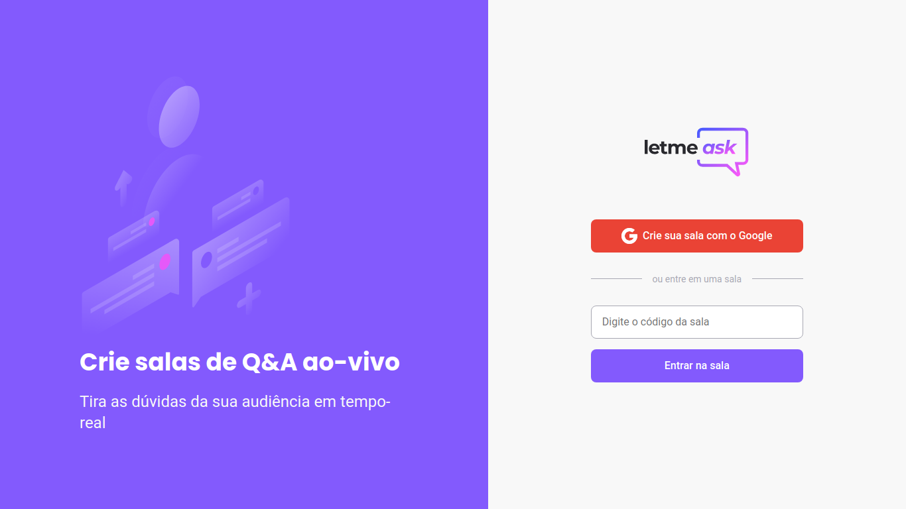

# LetMeAsk - NLW #6



## Projeto
**Letmeask** permite maior engajamento entre criadores de conteúdo e o seu público através de salas de Q&A.
## Fluxo do programa
### Streamer
O/A streamer, usando a sua conta do Google, precisa realizar o login na aplicação. Após o login, ele poderá digitar o nome da nova sala e criá-la.
Nessa nova tela, ele poderá ver as perguntas em tempo real nessa nova sala.
Ele também terá em posse o código da sala, o qual poderá compartilhar com os seu seguidores
### Espectador
Com o código da sala, o espectador poderá acessar a sala diretamente.
Ele terá acesso ao código da sala, ao nome da sala, poderá ver as perguntas em tempo real e dar *likes* nas perguntas. Caso esteja logado com a sua conta Google, poderá fazer uma pergunta.
## Tecnologias utilizadas
* React
* Typescript
* NPM
* Firebase CLI
* Firebase Realtime Database
* SCSS
## Como executar
Clone o projeto e acesse a pasta do mesmo.
```bash
$ git clone https://github.com/joaolaureano/NLW_06.git
$ cd NLW_06
```
Para iniciá-lo, siga os passos abaixo:
```bash
# Instalar as dependências
$ npm install

# Iniciar o projeto
$ npm run start
```
O app estará disponível no seu browser pelo endereço http://localhost:3000.

Lembrando que será necessário criar uma conta no [Firebase](https://firebase.google.com/) e um projeto para disponibilizar um Realtime Database.

Para integrar o Firebase à essa aplicação, atualize os valores do arquivo *.env_example* com as informaçẽos do teu projeto Firebase, e mude o nome do arquivo para *.env*.
## Deploy
O deploy da aplicação foi feita no Firebase Hosting.

Veja a aplicação [aqui](https://letmeask-56af7.web.app)
## Pontos de melhorias
 - Quando o usuário entra em uma sala, tenta enviar uma pergunta e NÃO está logado, dá erro na aplicação
 - Quando tenta entrar em uma sala inexistente, é soltado um alert()
- Dar like sem estar logado dá erro na aplicação
   - Trocar por mensagem mais amigável/
    - Snackbar é interessante
- Quando entra em uma sala, não existe opção para sair da sala
  - Colocar algum botão que permita a saída da sala
    - Ideia é usar o botão de feedback ensinado na NLW 8
 - Não existe opção para o streamer responder a pergunta
   - Permitir que o streamer consiga responder a pergunta do espectador
- Não existe informação relativa a data da pergunta
  - Criar um campo que indique a data de cada pergunta
  - Seria legal uma forma de ordenar por data ou por like
- A tela da sala do/da streamer é a mesma que a do/da espectador/espectadora
  - Fazer outra tela, com as diferenças de features
    - Não faz sentido, por ex, streamer fazer uma pergunta
- Integração com o Twitter/Facebook/Discord parece interessante
  - Streamer poderia compartilhar a sua sala com os seus seguidores
- Seria interessante poder fazer perguntas anônimamente
- Like apenas logado

<p align="center">
Feito com 💜 by João Pedro Laureano
</p>